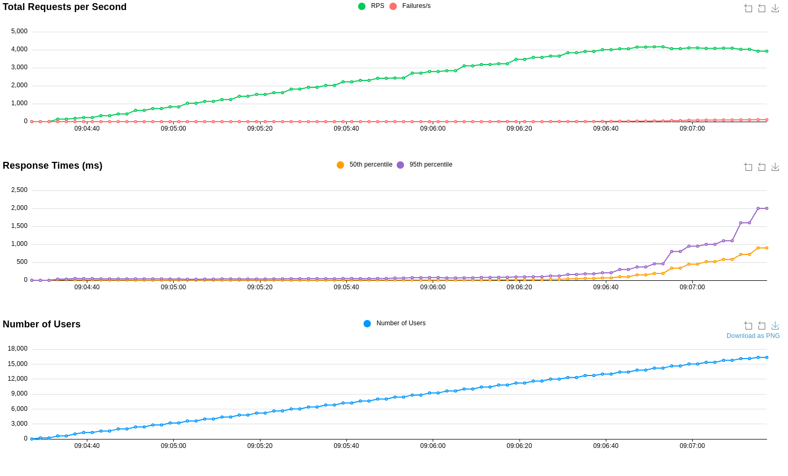

# API de Recomendação XPTO

A API de Recomendação XPTO foi criada para sugerir produtos relevantes a novos usuários do marketplace XPTO. Utilizando uma base histórica de vendas e um algoritmo heurístico parametrizável, a API fornece recomendações personalizadas para aprimorar a experiência do usuário.

## 1. Algoritmo de Recomendação

Para visualizar as fórmulas matemáticas corretamente, é recomendado utilizar um compilador de Markdown que suporte LaTeX, como o MathJax, ou uma plataforma compatível, como Jupyter Notebooks ou VS Code com a extensão apropriada.

Se estiver visualizando este documento no GitHub ou em outro ambiente sem suporte nativo a fórmulas matemáticas, as equações podem não ser renderizadas corretamente.

### 1.1 Seleção dos Produtos
Os produtos recomendados são selecionados de forma pseudoaleatória com probabilidades proporcionais à quantidade de vendas. É possível adicionar viés exponencial às vendas, de forma a favorecer ainda mais os produtos mais vendidos.

Definição dos termos:

- \( P \) é o conjunto de todos os produtos disponíveis.
- \( p_i \) um produto \( i \) em \( P \).
- \( s_{p_i} \) é a pontuação de vendas por dia do produto \( p_i \).
- \( n \) é o número de produtos recomendados a serem selecionados.

1. **Calcular as Pontuações de Vendas por Dia**:
   Para cada produto \( p_i \) em \( P \), calcule a pontuação de vendas por dia \( s_{p_i} \) como:

   \[
   s_{p_i} = \frac{ \text{vendas\_por\_dia}_{p_i}^\text{sales\_bias} }{ \sum_{p_j \in P} \text{vendas\_por\_dia}_{p_j}^\text{sales\_bias} }
   \]

   onde \( \text{vendas\_por\_dia}_{p_i} \) é a venda diária do produto \( p_i \), e \( \text{sales\_bias} \) é o viés aplicado.

2. **Selecionar Produtos com Base na Pontuação**:
   A seleção dos produtos é feita por amostragem ponderada, onde a probabilidade de selecionar um produto \( p_i \) é proporcional à sua pontuação \( s_{p_i} \):

   \[
   \Pr(p_i \text{ é selecionado}) = s_{p_i}
   \]

   Portanto, amostramos \( n \) produtos aleatoriamente com base em suas pontuações \( s_{p_i} \).

### Exemplo:

Suponha que temos três produtos \( p_1, p_2, p_3 \) com pontuações de vendas por dia \( s_{p_1} = 0.5 \), \( s_{p_2} = 0.3 \), e \( s_{p_3} = 0.2 \). Se queremos selecionar 2 produtos, usamos a distribuição de probabilidade dada por \( s_{p_i} \) para amostrar os produtos:

- A probabilidade de selecionar \( p_1 \) é 0.5.
- A probabilidade de selecionar \( p_2 \) é 0.3.
- A probabilidade de selecionar \( p_3 \) é 0.2.

A amostragem será realizada de acordo com essas probabilidades, e retornaremos os \( n \) produtos selecionados.

### 1.2 Seleção do Anúncio
Uma vez definido os produtos anunciados, definimos o anúncio para cada um deles considerando o preço e as vendas das lojas. A seleção também é pseudoaleatória e pode ser enviesada exponencialmente.

Definição dos termos:

- \( P \) é o conjunto de produtos disponíveis.
- \( p_i \) representa um produto \( i \) em \( P \).
- \( c_{p_i} \) é a pontuação combinada do produto \( p_i \).
- \( \text{price\_score}_{p_i} \) é a pontuação de preços do produto \( p_i \).
- \( \text{store\_score}_{p_i} \) é a pontuação de vendas na loja do produto \( p_i \).
- \( w_p \) é o peso aplicado à pontuação de preços.
- \( w_s \) é o peso aplicado à pontuação de vendas na loja.


1. **Calcular a Pontuação de Preços**:
   Para cada produto \( p_i \), a pontuação de preços é calculada como a inversa do preço do produto, ajustada por um viés de preço. A fórmula é:

   \[
   \text{price\_score}_{p_i} = \frac{1}{\text{product\_price}_{p_i}^{\text{price\_bias}}}
   \]

   onde \( \text{product\_price}_{p_i} \) é o preço do produto \( p_i \) e \( \text{price\_bias} \) é o viés aplicado.

2. **Normalizar a Pontuação de Preços**:
   A pontuação de preços é normalizada para garantir que a soma das pontuações normalizadas seja 1. A fórmula para normalização é:

   \[
   \text{price\_score}_{p_i} = \frac{\text{price\_score}_{p_i}}{\sum_{p_j \in P} \text{price\_score}_{p_j}}
   \]

3. **Calcular a Pontuação de Vendas na Loja**:
   Para cada produto \( p_i \), a pontuação de vendas na loja é calculada a partir da pontuação de vendas na loja associada ao produto, ajustada por um viés de vendas na loja. A fórmula é:

   \[
   \text{store\_score}_{p_i} = \text{sales\_per\_day\_store\_score}_{p_i}^{\text{store\_sales\_bias}}
   \]

   onde \( \text{sales\_per\_day\_store\_score}_{p_i} \) é a pontuação de vendas por dia na loja do produto \( p_i \) e \( \text{store\_sales\_bias} \) é o viés aplicado.

4. **Normalizar a Pontuação de Vendas na Loja**:
   A pontuação de vendas na loja é normalizada da mesma forma que a pontuação de preços:

   \[
   \text{store\_score}_{p_i} = \frac{\text{store\_score}_{p_i}}{\sum_{p_j \in P} \text{store\_score}_{p_j}}
   \]

5. **Calcular a Pontuação Combinada**:
   A pontuação combinada \( c_{p_i} \) é então calculada como uma média ponderada das pontuações de preços e vendas na loja:

   \[
   c_{p_i} = \frac{\text{price\_score}_{p_i} \times w_p + \text{store\_score}_{p_i} \times w_s}{\text{price\_score}_{p_i} \times w_p + \text{store\_score}_{p_i} \times w_s}
   \]

   onde \( w_p \) é o peso atribuído à pontuação de preços e \( w_s \) é o peso atribuído à pontuação de vendas na loja. A pontuação combinada é normalizada para garantir que a soma das pontuações combinadas seja 1.

### Exemplo:

Suponha que temos três produtos \( p_1, p_2, p_3 \) com as seguintes pontuações calculadas:

- \( \text{price\_score}_{p_1} = 0.4 \), \( \text{store\_score}_{p_1} = 0.6 \)
- \( \text{price\_score}_{p_2} = 0.3 \), \( \text{store\_score}_{p_2} = 0.4 \)
- \( \text{price\_score}_{p_3} = 0.2 \), \( \text{store\_score}_{p_3} = 0.8 \)

Se os pesos são \( w_p = 0.5 \) e \( w_s = 0.5 \), então:

- A pontuação combinada para \( p_1 \) será ajustada com base em \( \text{price\_score}_{p_1} \) e \( \text{store\_score}_{p_1} \).
- A pontuação combinada para \( p_2 \) será ajustada com base em \( \text{price\_score}_{p_2} \) e \( \text{store\_score}_{p_2} \).
- A pontuação combinada para \( p_3 \) será ajustada com base em \( \text{price\_score}_{p_3} \) e \( \text{store\_score}_{p_3} \).

O produto com a maior pontuação combinada será o escolhido para o anúncio.

Essa abordagem assegura que produtos com boas pontuações tanto em preço quanto em vendas na loja tenham maior probabilidade de serem escolhidos para o anúncio.

## 2. Tecnologias

### 2.1 **FastAPI**
- **Intuitivo**: Fácil de usar, com uma curva de aprendizado rápida.
- **Robusto**: Suporta aplicações complexas e de alta performance.
- **Comunidade**: Código aberto, com uma comunidade ativa e em crescimento.
- **Altamente eficiente**: Framework moderno, aproveita as últimas funcionalidades do Python.
- **Assíncrono**: Suporte nativo ao processamento assíncrono, ideal para lidar com múltiplas requisições simultâneas.
- **Suporte à tipagem**: Facilita a manutenção e a depuração do código, promovendo a segurança e a clareza.

#### **Por que não Django?**
- **Excesso de recursos**: Embora poderoso e completo, Django pode ser excessivo para APIs focadas apenas em desempenho e flexibilidade.
- **Natureza monolítica**: Django possui uma estrutura monolítica, que pode introduzir maior sobrecarga e complexidade desnecessária para projetos mais simples ou focados em alta performance.

#### **Por que não Flask?**
- **Ausência de suporte nativo à tipagem**: Flask não oferece suporte nativo à tipagem, o que pode dificultar a manutenção do código em projetos maiores.
- **Falta de processamento assíncrono**: Sem suporte nativo para operações assíncronas, Flask pode ter um desempenho inferior em aplicações que exigem alta carga de requisições ou complexidade.

### 2.2 **Pandas**
- **Integração com bibliotecas**: Funciona bem com outras bibliotecas populares de ciência de dados, como NumPy, SciPy e Matplotlib.
- **Comunidade ativa**: Uma grande comunidade de usuários e desenvolvedores.
- **Documentação abrangente**: Documentação bem elaborada, com tutoriais e exemplos que facilitam a aprendizagem e a resolução de problemas.
- **Integração com Jupyter Notebooks**: Compatível com Jupyter Notebooks, permitindo uma análise interativa e visualização de dados.

#### **Por que não Polars?**

- **Comunidade menor**: Biblioteca relativamente nova em comparação com Pandas, resultando em uma comunidade menor e menos suporte da comunidade.
- **Desempenho desnecessário**: A principal vantagem do Polars é o desempenho em grandes conjuntos de dados. Para bases pequenas e pouca manipulação, o desempenho do Pandas é suficiente.

### 2.3 **Pytest**
- **Simplicidade e Flexibilidade**: Fácil de usar e não requer muita configuração.
- **Fixtures Poderosas**: Permite a criação de fixtures, que são blocos de código reutilizáveis para configurar ambientes de teste.
- **Plugins Extensivos**: Pytest tem uma vasta gama de plugins que ampliam suas funcionalidades. Plugins como pytest-django, pytest-flask, e pytest-cov facilitam a integração com frameworks web e ajudam na medição de cobertura de testes.
- **Execução Paralela de Testes**: Com o plugin pytest-xdist, você pode rodar testes em paralelo, acelerando significativamente o tempo de execução, algo muito útil para APIs com muitas rotas ou casos de uso complexos.

## 3. Instalação
### 3.1 Docker
```sh
docker build -t xpto_recommendation_api .
docker run -d --name xpto_recommendation_api xpto_recommendation_api
```

**Importante:** para alterar o número de workers da aplicação, altere o parâmetro -w no Dockerfile.

### 3.2 Sem Docker
```sh
pip install poetry
poetry install
```
**Sem paralelismo:**
```sh
poetry run uvicorn src.main:app
```
**Com paralelismo:**
```sh
poetry run gunicorn -w {n} -k uvicorn.workers.UvicornWorker src.main:app
```
O parâmetro **n** especifica o número de *workers*.
## 4. Rotas e Endpoints

### **GET** `/recommendations/{user_id}`

Esta rota retorna uma lista de recomendações de produtos para o usuário identificado pelo `user_id`.

#### Exemplo de Requisição

```http
GET /recommendations/12345
```

#### Exemplo de Resposta:
```json
[
    {
        "product_id": 2,
        "product_title": "Notebook Dell Inspiron 15",
        "product_price": 650.62,
        "product_image_url": "https://placekitten.com/19/128",
        "store_id": 12,
        "store_name": "Livraria Cultura"
    },
    {
        "product_id": 6,
        "product_title": "Cafeteira Nespresso",
        "product_price": 384.22,
        "product_image_url": "https://placekitten.com/931/680",
        "store_id": 5,
        "store_name": "Casas Bahia"
    },
    {
        "product_id": 21,
        "product_title": "Ar Condicionado Split LG",
        "product_price": 823.14,
        "product_image_url": "https://placekitten.com/917/270",
        "store_id": 19,
        "store_name": "Shoptime"
    },
    {
        "product_id": 29,
        "product_title": "Caixa de Som Bluetooth Bose",
        "product_price": 594.54,
        "product_image_url": "https://dummyimage.com/771x577",
        "store_id": 17,
        "store_name": "Ricardo Eletro"
    },
    {
        "product_id": 36,
        "product_title": "Home Theater Sony",
        "product_price": 11.13,
        "product_image_url": "https://placekitten.com/34/283",
        "store_id": 20,
        "store_name": "Submarino"
    }
]
```

## 4. Testes de Performance
**Biblioteca Utilizada:** Locust
**Processos da API:** 16
**Processos de Teste:** 8
**Taxa de incremento de usuários:** 100 usuários / segundo



Importante ressaltar que executar os testes e a API na mesma máquina impactam negativamente na performance da API. Em situações de alta carga, o teste e a API disputam recursos e interferem no desempenho. Entretanto, para uma execução local em apenas uma máquina, 4.000 RPS é um bom resultado. Para incrementar essa métrica seria possível:

1. **Aumentar o número de workers**: Ajustar o número de workers da API pode ajudar a lidar com mais requisições simultâneas, dependendo da capacidade da máquina.
2. **Escalonar horizontalmente**: Implementar balanceamento de carga e distribuir a aplicação em múltiplos servidores pode aumentar significativamente a capacidade de requisições por segundo (RPS).
3. **Realizar os testes e a API em máquinas separadas**: Como mencionado anteriormente, quando o teste e a API são executados em uma mesma máquina, ambos disputarão recursos e terão suas performances afetadas negativamente.